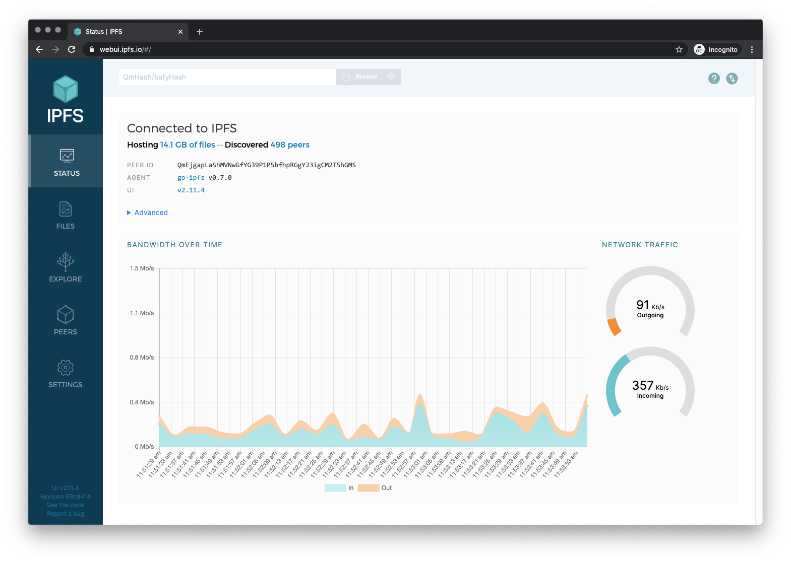

#Web3

> An interface to [IPFS](https://ipfs.io).

> Check on your node stats, explore the IPLD powered merkle forest, see peers around the world and manage your files, without needing to touch the CLI.

